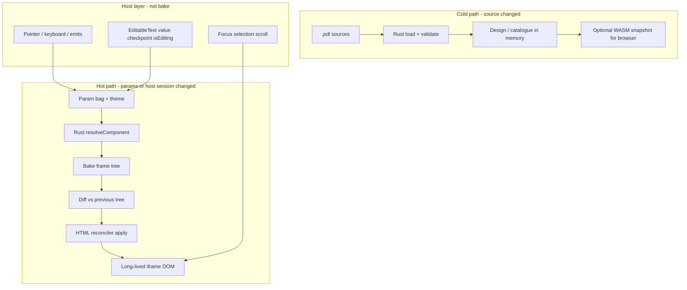

# Proposal: Incremental preview apply (ideal IR reconciler)

**Status:** implemented (Playground hot path)  
**Assumptions:** Rust owns bake/resolve; HTML remains the interactive preview surface.

**Shipped:** Param/interaction updates use identity-preserving live apply (HTML morph + optional bake-IR reconcile) instead of `iframe.srcdoc` remount. Source/theme/engine changes still remount. See `playground/src/preview-apply.js`, `src/bakeReconcile.ts`, Playground status `· live apply`.

## Summary

Interactive preview should treat bake IR as a live scene graph and reconcile it into a long-lived DOM. Replacing `iframe.srcdoc` on every param change is an accident of the current Playground loop, not a language requirement.

```text
Today:  params' → bake → HTML string → iframe.srcdoc = …   // destroy world
Ideal:  params' → resolve (Rust) → bake IR → reconcile DOM  // reuse nodes
```

HTML is a **projection** of bake IR. Full HTML serialization stays useful for first paint and static export—not as the interactive engine.

---

## Diagnosis

The language model is already right: **parameters → resolve → tree**. The flicker comes from treating every new tree as a new document (focus loss, scroll jump, host rebind, blur-as-commit races).

Nested `pdl-state` / `pdl-inst-state` dual-bake already avoids remount for some chrome axes. Parent shell SoT (`if editing { children = […] }`, emit-driven params) still forces a full rewrite.

---

## Ideal architecture



### 1. Split cold compile from hot resolve

| Path | When | Work |
|------|------|------|
| **Cold** | Source edit, import graph change | Load design, validate, build catalogue, theme maps |
| **Hot** | Knob, emit capture, host verb, fixture | `resolveComponent(name, params, theme) → bake tree` only |

The hot path should never build a new `<html>` document. Once WASM is warm, it need not round-trip the server. Rust remains the resolver; CLI/server resolve is a fine stepping stone to in-browser WASM.

### 2. Bake IR is the live scene graph

The bake JSON frame tree (ids, kinds, props, children, `instanceOf` / kwargs) is the **scene graph SoT** for preview.

- Same IR catalogue emitters and native hosts would consume.
- Interactive preview is “host that can apply IR repeatedly,” not “string of HTML that happens to include a script.”

Catalogue already points here: `childNodes`, `childHierarchy`, `structuralChange`. Live preview should use **frame identity + hierarchy**, not ad-hoc dual HTML snapshots as the core model.

### 3. HTML reconciler (the real product)

A dedicated reconciler owns IR → DOM:

1. **Mount** (first paint): walk bake tree → create DOM, stamp stable keys.
2. **Update**: diff previous IR vs next IR.
   - Same identity → **patch props** (style, text, visibility, border, …).
   - Child list change → **insert / move / remove** by identity (Edit vs Done/Cancel).
   - Instance kwargs / nested resolve → reconcile that subtree.
3. **Never** replace `document` / `srcdoc` on a param tick.

Identity keys:

- Author frame id → `data-pdl-id`
- Nested component mount → `data-pdl-instance-let` (stable across parent `if` branches when the let exists in both)
- ForEach rows → explicit list identity when the language has it (index is a known footgun until then)

This is closer to SwiftUI/Flutter element reuse—or a React reconciler whose VDOM is bake IR—than to morphdom-on-HTML-strings. Morphding HTML can approximate it; it is not the ideal end state because the host then diffs presentation noise instead of language meaning.

### 4. Host ephemerals vs bake truth

| Bake / resolve owns | Host owns (ephemeral) |
|---------------------|------------------------|
| Layout, paint props, which children exist | Focus, caret, selection |
| Committed params (`editing`, `committed`, `status`) | Scroll positions |
| Injected protocol facts after resolve (`isEditing`, `value` when part of tree) | In-flight IME / session checkpoint until commit |
| Structure from `if` / ForEach | Hit-testing affordances, pointer capture |

**EditableText:** typing updates a host session bag and may patch the input DOM value immediately (no resolve per keystroke). Begin/finish/cancel updates params → one resolve → reconcile. Shell chrome (`if editing`) comes from that resolve.

### 5. Interaction pipeline

```text
DOM event
  → host interprets (PointerInput / EditableText policy)
  → run catalogue handlers / emit captures (pure param algebra)
  → new params
  → resolve → reconcile
```

`previewHandled` / dual-bake are unnecessary as architecture: local chrome is either host ephemeral or real params that re-resolve cheaply. Prebaked hover trees are an **optimization** if resolve is too slow for mousemove—not the conceptual model.

### 6. First paint vs export

- **Interactive preview:** IR reconciler into long-lived DOM.
- **Static HTML export / catalogue pages:** keep `renderHtml(bake) → string` as a cold serializer.
- Mount and patch should share one prop→CSS applicator.

---

## NoteEditor in the ideal world

1. Click Edit or field → emit `began` → `editing = true`, seed `draft`.
2. Hot resolve NoteEditor with new params.
3. Diff: `Edit` removed; `Cancel`/`Done` inserted; `Status` patched; `Input` **same let** → DOM reused; editing chrome patched; focus restored.
4. No iframe remount, no scroll jump, no blur-as-commit from document teardown.

Typing: host session only. Done/Enter: params → resolve → reconcile (structure back to Edit).

---

## What is not ideal

- **HTML string morph as the engine** — fine bridge; diffs the wrong artifact.
- **Dual-bake / hidden sibling trees as the engine** — fine cache for hover; poor general shell model (combinatorics).
- **Hand-updating DOM inside emit handlers** without resolve — forks a second UI language; lies to native hosts.
- **React component host as the PDL runtime** — optional future emitter; not required if IR→DOM reconciler exists.

---

## Performance shape

| Tick | Ideal cost |
|------|------------|
| Keystroke in field | O(1) DOM value / session bag |
| Hover (paint-only) | Host ephemeral, or resolve if author tied paint to params |
| Edit / Done / Cancel / knob | Resolve one component + IR diff + localized DOM mutate |
| Source edit | Cold reload design + full remount (acceptable) |

Target: interactive ticks in **ms of resolve+diff**, not full document parse.

---

## Pragmatic bridge (from today)

Ordered on-ramps—not the end state:

1. **Shared prop applicator** — factor `src/renderHtml.ts` so mount and patch use the same mapping.
2. **Hot resolve API** — `resolve` / `bakeComponent` JSON without HTML; then WASM.
3. **IR reconciler v1** — replace `srcdoc` for param ticks; keep `srcdoc` for cold path.
4. **Session/focus registry** — by instance-let, survive reconcile.
5. **Optional:** HTML morph or structural dual-bake as temporary relief before the reconciler lands.

---

## Success criteria

- Param-driven preview updates never assign `iframe.srcdoc`.
- NoteEditor open/close preserves scroll; Input identity survives; focus can be restored intentionally.
- Keystrokes never resolve.
- Same bake IR can drive HTML preview and (later) another host without rewriting interaction authoring.

---

## Related

- Current dual-bake / `previewHandled` behavior: Playground P4, `playground/server/playground-server.mjs`, `src/renderHtml.ts`
- EditableText shell funnel: `docs/PROPOSAL_TEXTFIELD_EDITING_SESSIONS.md`, `test-fixtures/pdl/playground/lab_editable_text.pdl`
- Catalogue identity: full-spec §16 (`childNodes`, `childHierarchy`, `structuralChange`)
